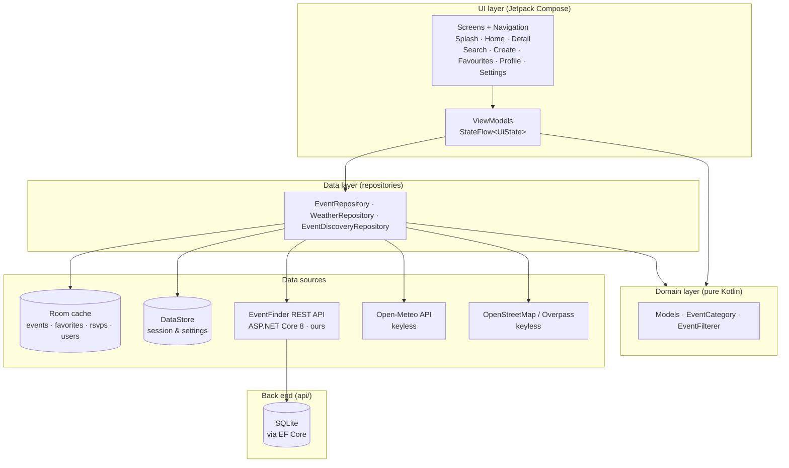
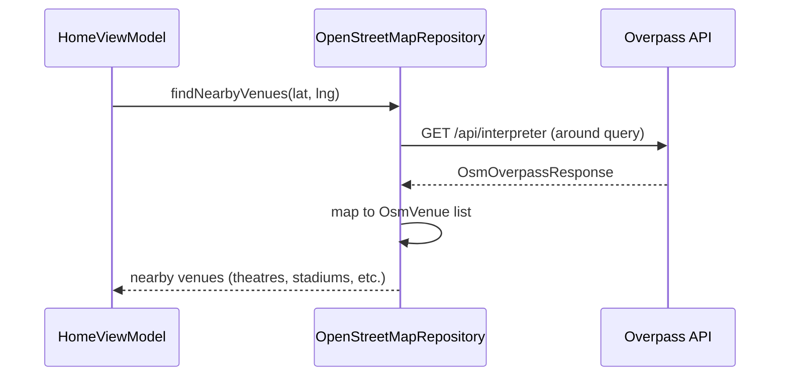
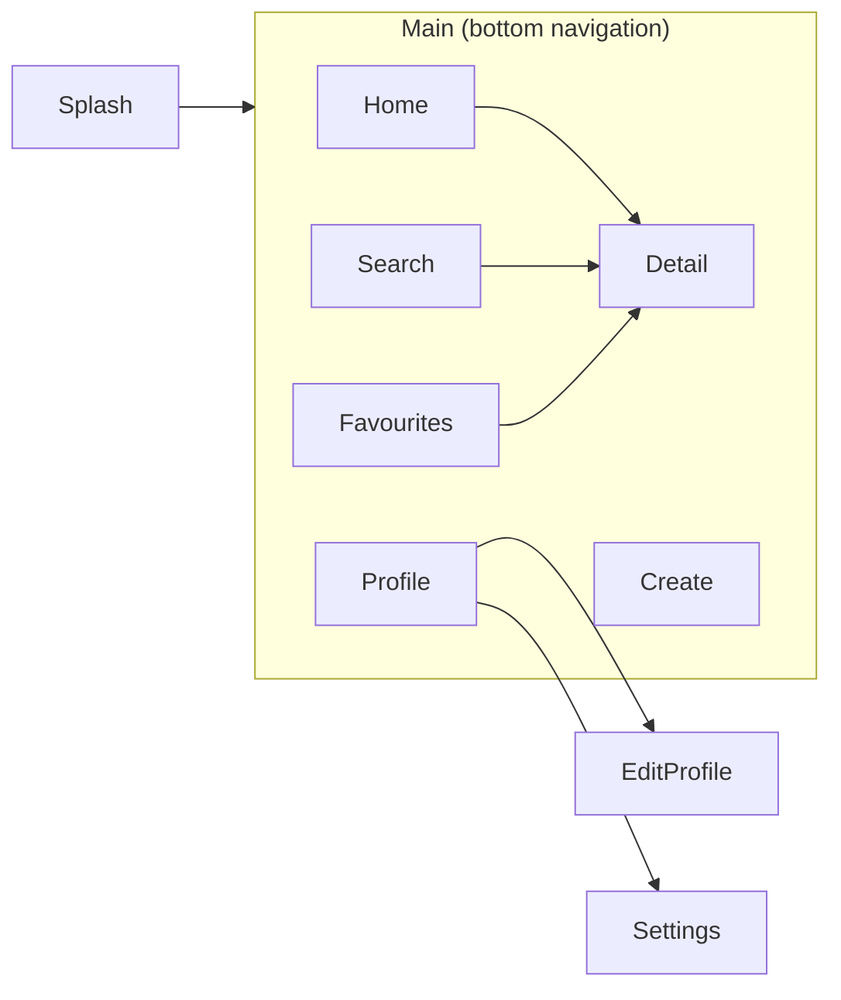

# EventFinder South Africa

[](https://github.com/kallanjones/prog7314-g3-2026-formative-2-part-2-kallanjones/actions/workflows/android-ci.yml)


A native **Android (Kotlin + Jetpack Compose)** app that helps people across South Africa
discover, save and create local events — from Joburg jazz nights to Cape Town food markets
and Durban festivals.

EventFinder was built as the **Part 2 Portfolio of Evidence** for PROG7314. It is made up
of two pieces:

- **`app/`** — the native Android client.
- **`api/`** — our own **ASP.NET Core 8** REST API, backed by Entity Framework Core and
  SQLite, which stores the event catalogue.

The app also consumes several free, keyless public APIs for weather, geocoding and public
event feeds, so no paid infrastructure is required.

## Demonstration video

📹 **[Watch the demonstration video](#)** — _replace this link with the unlisted YouTube URL
before submission._

The video covers registration and sign-in (including Google SSO), the settings menu, the
data round-trip against the hosted REST API, and the user-defined features.

---

## Table of contents

1. [Features](#features)
2. [Screenshots](#screenshots)
3. [Tech stack](#tech-stack)
4. [Architecture](#architecture)
5. [Our REST API](#our-rest-api)
6. [External APIs](#external-apis)
7. [Localisation](#localisation)
8. [Offline-first behaviour](#offline-first-behaviour)
9. [Security](#security)
10. [Getting started](#getting-started)
11. [Testing](#testing)
12. [Continuous integration](#continuous-integration)
13. [Project structure](#project-structure)
14. [Requirement traceability](#requirement-traceability)
15. [Attribution & licences](#attribution--licences)

---

## Features

| Area | What it does |
| --- | --- |
| **Discover** | Browse the local event catalogue, filter by category chip and free-text keyword, sort by date / distance / name. |
| **Near me** | Requests location permission and sorts events by distance using the Haversine great-circle formula. |
| **Map** | Event locations plotted on a free OpenStreetMap map (osmdroid) — no Google Maps key or billing. |
| **Event detail** | Hero image, organiser, attendee count, venue map link, **weather forecast at the venue** on the event day, share and RSVP. |
| **Search** | Debounced keyword search with recent-search history and popular events. |
| **Create event** | A 3-step wizard (details → date/time → location) with an optional photo picked from the system photo picker. |
| **My events** | Organisers can edit or delete the events they created from the detail screen's overflow menu. |
| **Favourites** | Save events offline; favourites survive app restarts and are stored in the local Room catalogue. |
| **Profile** | Activity stats (created / attending / favourites), My Events and Attending lists. |
| **Edit profile** | Update display name and email with validation. |
| **Settings** | Language switch (English / Afrikaans), event reminders, new-event alerts, plus account tools (clear local cache, delete account). |
| **Reminders** | `AlarmManager` + `NotificationChannel` reminders **24 hours and 1 hour** before an attended event, cancelled when the RSVP is declined. |
| **Event alerts** | On-device notifications flag newly added or changed events in the local Room catalogue — computed by a pure diff, no push service required. |

## Screenshots

Every screen below was captured from the running app on an Android 14 (API 34)
emulator at 1080 × 2340.

| Login | Register | Forgot password | Home (Discover) |
| :---: | :---: | :---: | :---: |
|  |  |  |  |

| Event detail | Map | Favourites | Search |
| :---: | :---: | :---: | :---: |
|  |  |  |  |

| Create – details | Create – date & venue | Date picker | Create – review |
| :---: | :---: | :---: | :---: |
|  |  |  |  |

| Profile | Edit profile | Settings |
| :---: | :---: | :---: |
|  |  |  |

## Tech stack

| Layer | Choice | Why |
| --- | --- | --- |
| Language | **Kotlin 1.9.22** | First-class Android language, coroutines, null-safety. |
| UI | **Jetpack Compose** (BOM 2024.02, Material 3) | Declarative UI, single activity, no XML layouts. |
| Architecture | **MVVM + Repository** | Testable, unidirectional data flow (`StateFlow`). |
| DI | **Manual `AppContainer`** | Transparent, dependency-free alternative to Hilt for a prototype. |
| Local DB | **Room 2.6.1** | Compile-time verified SQLite for the offline event cache. |
| Preferences | **DataStore Preferences 1.0** | Async, type-safe key/value storage for settings & session. |
| Networking | **Retrofit 2.9 + OkHttp 4.12 + Gson** | Industry standard REST client with logging interceptor. |
| Images | **Coil 2.6** | Coroutine-friendly Compose image loading. |
| Maps | **osmdroid 6.1.18** | Free OpenStreetMap tiles, no API key, no billing. |
| Security SDK | **AndroidX Biometric 1.1** | Fingerprint / face unlock. |
| SSO | **AndroidX Credential Manager 1.3** | Google sign-in, the flow Google currently recommends. |
| **Back end** | **ASP.NET Core 8 Minimal API** | Our own REST API (`api/`), per the Part 1 design. |
| **Back-end ORM / DB** | **EF Core 8 + SQLite** | Code-first schema; a single file, so it hosts on any free tier. |
| Build | **AGP 8.2.2, Gradle 8.7, JDK 17** | Current stable toolchain. |
| Tests | **JUnit 4 + kotlinx-coroutines-test** | Pure JVM unit tests, no device required. |

## Architecture

EventFinder follows a clean three-layer **MVVM** architecture. The UI layer never talks to
Retrofit or Room directly — everything flows through repositories that hide the data sources.

### Layered overview



### Venue discovery flow



### Navigation graph



## Our REST API

The event catalogue is served by **our own REST API**, which lives in [`api/`](api) and is
documented in full in [`api/README.md`](api/README.md).

It is an **ASP.NET Core 8 Minimal API** using **Entity Framework Core (code-first)** over
**SQLite**. The Planning and Design document specified Azure SQL; SQLite is used instead so
the service can be hosted on any free tier without provisioning a separate database server.
The schema, endpoints and response envelope are otherwise as designed.

### Endpoints

| Method | Route | Purpose |
| --- | --- | --- |
| `GET` | `/api/health` | Liveness probe |
| `GET` | `/api/events` | List events (`?category=`, `?q=`, `?page=`, `?pageSize=`) |
| `GET` | `/api/events/{id}` | Fetch one event |
| `POST` | `/api/events` | Create an event |
| `PUT` | `/api/events/{id}` | Update an event |
| `DELETE` | `/api/events/{id}` | Delete an event |

Every response uses the same envelope, so the client handles all outcomes the same way:

```json
{ "success": true, "data": { }, "message": null, "errors": null }
```

Validation failures return **400** with field-level messages in `errors`; unknown ids
return **404**. Swagger UI is served at `/swagger` for demonstrating the round-trip.

### How the app consumes it

`EventFinderApiSource` implements the same `EventSource` interface as the public feeds, so
events from our API flow into the Room cache through the existing ingestion pipeline:

```
EventFinderApi (Retrofit)
        │
        ▼
EventFinderApiSource ──┐
RssEventSource ────────┤
IcsEventSource ────────┼──▶ EventDiscoveryRepository ──▶ Room ──▶ UI
PublicJsonEventSource ─┘
```

The base URL is a per-build-type `BuildConfig` field set in `app/build.gradle.kts`:

| Build type | `API_BASE_URL` |
| --- | --- |
| `debug` | `http://10.0.2.2:5217/` — the host machine as seen from the emulator |
| `release` | The deployed HTTPS URL |

### Running it

```bash
cd api/EventFinder.Api
dotnet run --urls http://localhost:5217
```

Start the API before launching a debug build of the app. Events created through
`POST /api/events` appear in the app's Discover list on the next refresh.

## External APIs


EventFinder uses public services that do not require API keys or tokens:

| Service | Auth | Used for |
| --- | --- | --- |
| **Open-Meteo** | Keyless | Weather forecasts |
| **OpenStreetMap** | Keyless | Map data |
| **Overpass API** | Keyless for normal OSM data queries | Nearby venues and event-related places |
| **Ardent Africa** | Keyless (optional API key for higher limits) | Public event discovery |
| **Android Location APIs** | Device permission | Current device location |
| **Room / SQLite** | Local | Events, users, favourites and RSVPs |

### OpenStreetMap / Overpass

Overpass is used to discover nearby event-related places such as:

- theatres
- cinemas
- arts centres
- museums
- galleries
- stadiums
- sports centres
- community centres
- conference centres
- attractions
- theme parks
- zoos

Overpass provides OpenStreetMap objects rather than a commercial event calendar.
Therefore OSM venue discovery does not fabricate event dates or scheduled performances.

Actual scheduled EventFinder events are stored locally in Room and may be created by
the user.

OpenStreetMap data is © OpenStreetMap contributors.

OpenStreetMap requires appropriate attribution when using its data.

### Public JSON event feeds

EventFinder can discover real-world events from keyless public JSON feeds. The pipeline works as follows:

1. Each `EventSource` implementation fetches events from its endpoint.
2. `PublicJsonEventMapper` normalises different JSON schemas into a common `RemoteEvent` model.
3. `EventDiscoveryRepository` validates each event (future-only, valid coordinates, non-blank title).
4. Valid events are upserted into Room with `remote:` prefixed IDs to prevent collisions with user-created events.
5. Events without valid coordinates are rejected since they cannot be plotted on the map.

Currently configured sources:

| Source | URL | Key required |
| --- | --- | --- |
| **Aticket South Africa** | `https://za.aticket.net/feed/featured-events` (RSS) | No |
| **Motorsport South Africa** | `https://www.motorsport.co.za/events/list/?ical=1` (ICS) | No |
| **Ardent Africa** | `https://api.ardent.africa/public/v1/events` (JSON) | No |

New sources can be added in `SouthAfricaEventSources.kt` without changing any other code.
The `PublicJsonEventClient` handles `{ "events": [...] }`, `{ "data": [...] }`, `{ "results": [...] }`,
and bare JSON array formats automatically. RSS and ICS sources are parsed by `RssEventSource` and
`IcsEventSource` respectively.

## Localisation

The whole UI is externalised to string resources and ships in two languages:

- `res/values/strings.xml` — **English**
- `res/values-af/strings.xml` — **Afrikaans**

The language is switched at runtime from **Settings** (persisted in DataStore) and applied
through `LocaleManager` in `MainActivity.attachBaseContext`.

## Offline-first behaviour

- Events, favourites and RSVPs are cached in **Room** and observed as `Flow`s, so the UI renders instantly.
- Favourite, RSVP and event mutations are wrapped in **atomic `@Transaction` boundaries** for consistency.
- The app attempts to discover public JSON event feeds when online; discovery failure never blocks the local catalogue.
- Reminder alarms carry the owning `userId` and `ReminderReceiver` verifies the active session before posting, preventing stale-account notifications.
- The UI never blocks on the network: a failed discovery simply keeps the cached catalogue.

## Security

- Credentials never leave the device. `local.properties` and keystores are git-ignored.

## Getting started

### Prerequisites

- **Android Studio Hedgehog** (or newer) or the Android command-line tools
- **JDK 17** (`JAVA_HOME` must point at it — AGP 8.x does not support JDK 21)
- Android SDK with **API 34** platform + build-tools
- A physical device or emulator running **API 26+**

### 1. Clone

```bash
git clone https://github.com/kallanjones/prog7314-g3-2026-formative-2-part-2-kallanjones.git
cd eventfinder-south-africa
```

### 2. Configure the SDK path

Create `local.properties` in the project root (git-ignored):

```properties
sdk.dir=C\:\\Users\\<you>\\AppData\\Local\\Android\\Sdk
```

### 3. No API keys required

EventFinder does not require:

- API keys
- API tokens
- developer accounts
- cloud backend credentials
- secrets embedded in the APK

Open-Meteo and OpenStreetMap/Overpass are accessed directly by the Android app.

### 4. Build & install

```bash
# Linux / macOS / Git Bash
./gradlew assembleDebug
adb install -r app/build/outputs/apk/debug/app-debug.apk

# Windows (PowerShell)
$env:JAVA_HOME="C:\Program Files\Java\jdk-17"
.\gradlew.bat assembleDebug
adb install -r app\build\outputs\apk\debug\app-debug.apk
```

## Testing

The project has **159 JVM unit tests** for the app and **8 endpoint tests** for the API, all
runnable from the command line with no emulator:

```bash
# Android app
./gradlew testDebugUnitTest

# REST API
dotnet test api/EventFinder.Api.Tests
```

| Suite | Covers |
| --- | --- |
| `ValidatorsTest` | Email, password strength, name and the multi-field registration form. |
| `PasswordHasherTest` | PBKDF2 hashing, salting, verification and fail-closed behaviour on malformed values. |
| `DistanceCalculatorTest` | Haversine distance, symmetry, rounding and radius checks. |
| `EventFiltererTest` | Keyword / category / radius filtering (including address and description matching), three sort orders, distance attachment. |
| `WeatherRepositoryTest` | WMO weather-code descriptions and Open-Meteo payload handling. |
| `OpenStreetMapRepositoryTest` | Overpass venue query mapping and geographic bounding. |
| `EventRepositoryTest` | Seeding, favourite/RSVP toggling, event creation, editing/deleting with ownership guard, cache clearing — using in-memory DAO fakes. |
| `SampleEventsProviderTest` | Demo catalogue integrity (unique ids, valid SA coordinates, sane dates). |
| `CreateEventValidationTest` | Per-step wizard validation (required title/description, future date, venue, coordinate ranges) that drives the inline error messages. |
| `EventAlertDetectorTest` | Pure new-event / favourite-changed diffing, including quiet first sync and past-event suppression. |
| `DateTimeUtilsTest` | Relative date helpers (today/tomorrow, day & hour offsets) and stable date formatting. |
| `LoginViewModelTest` | Password-reset flows (mismatch, success) with a fake repository. |
| `EventDiscoveryRepositoryTest` | Event discovery pipeline: valid future events inserted, missing coordinates rejected, past events rejected, source failures handled gracefully, deduplication by stableId, multi-source merging. |
| `PublicJsonEventMapperTest` | Public JSON event DTO parsing: Ardent Africa string-location handling, object-location parsing, null-location graceful handling, mapper output validation. |

HTML reports are written to `app/build/reports/tests/testDebugUnitTest/index.html`.

### Instrumented UI tests

A small **Compose UI test** suite runs on a connected device/emulator and covers the shared
widgets (`app/src/androidTest/.../ui/components/CommonComponentsTest.kt`):

```bash
./gradlew connectedDebugAndroidTest
```

| Test | Covers |
| --- | --- |
| `eventCard_displaysTitleAndVenue` | Card renders the event title, venue and metadata. |
| `eventCard_clickInvokesCallback` | Tapping the card fires its `onClick`. |
| `eventCard_favouriteToggleInvokesCallback` | The heart button reports add/remove from its content description. |
| `categoryChips_selectsACategoryAndCanClearIt` | Category chips select and clear the filter. |
| `categoryChips_selectsTheActiveChip` | The active category exposes selected semantics; the others do not. |
| `emptyState_displaysTitleAndSubtitle` | The reusable `EmptyState` renders its icon, title and subtitle. |

## Continuous integration

GitHub Actions runs on every push / PR to `main` (`.github/workflows/android-ci.yml`).

**Job 1 — `api-test`** (REST API)

1. Set up **.NET 8**
2. `dotnet build` the API
3. `dotnet test` the 8 endpoint tests
4. Upload the API test report

**Job 2 — `build-and-test`** (Android app)

1. Validate the Gradle wrapper
2. Set up **JDK 17**
3. `./gradlew testDebugUnitTest`
4. `./gradlew lintDebug`
5. `./gradlew assembleDebug`
6. Upload the test report and the debug APK as build artifacts

**Job 3 — `instrumentation-test`** runs the Compose UI tests on an API 33 emulator.

CI never depends on a secret to compile — the public APIs are keyless, and Google sign-in
falls back to a "not configured" message when no client ID is set.

## Project structure

```
app/src/main/java/com/eventfinder/app/
├── data/
│   ├── local/          Room entities, DAOs, database + entity↔domain mappers
│   ├── remote/         Retrofit services, DTOs, API client (our API + Open-Meteo + Overpass)
│   ├── remote/dto/     Our API's response envelope + public JSON event DTOs
│   ├── remote/model/   Provider-independent RemoteEvent model
│   ├── repository/     Event / Auth / Weather / Discovery repositories + sample seed data
│   ├── sources/        EventSource interface, EventFinderApiSource, RSS/ICS/JSON sources
│   └── store/          DataStore user preferences
├── di/                 AppContainer (manual dependency injection)
├── domain/model/       Event, User, RSVP, categories, filter/sort engine
├── notifications/      Notification channel + reminder receiver
├── security/           Biometric authentication + Google sign-in (SSO)
├── ui/
│   ├── components/     Shared Compose components + UiMessage
│   ├── navigation/     NavHost + bottom navigation
│   ├── screens/        splash · auth · home · detail · search · create · favorites · profile · editprofile · settings
│   └── theme/           Material 3 colour scheme & typography
└── utils/              Logging, date/time, distance, validation, hashing, locale, network
app/src/test/java/com/eventfinder/app/   JVM unit tests
app/src/androidTest/java/com/eventfinder/app/   Compose instrumented UI tests
docs/screenshots/                        Real device screenshots

api/
├── EventFinder.Api/        ASP.NET Core 8 Minimal API
│   ├── Program.cs          Endpoint definitions, validation, DI
│   ├── Models/             EventEntity, request DTO, response envelope
│   └── Data/               EF Core DbContext (SQLite)
├── EventFinder.Api.Tests/  8 endpoint tests driving the real host over HTTP
└── README.md               API documentation and deploy steps
```

## Requirement traceability

| Requirement | Where it is implemented |
| --- | --- |
| **Creation of a REST API** | [`api/EventFinder.Api`](api) — ASP.NET Core 8 Minimal API, EF Core code-first, SQLite |
| **Integration of our REST API** | `EventFinderApi` (Retrofit) + `EventFinderApiSource`, feeding `EventDiscoveryRepository` |
| **SSO sign-in** | `GoogleSignInClient` (AndroidX Credential Manager) → `AuthRepository.signInWithGoogle` |
| **Settings menu** | `SettingsScreen` / `SettingsViewModel` — language, notifications, biometrics, cache, account |
| Third-party API integration | Open-Meteo (`WeatherRepository`) and OpenStreetMap/Overpass (`OpenStreetMapRepository`) — keyless |
| External library integration | Room, Retrofit/OkHttp, DataStore, Coil, osmdroid, AndroidX Biometric, Credential Manager |
| Native Android SDK integration | `AlarmManager` + `NotificationManager` reminders, `LocationManager`/location permissions, biometrics |
| Offline-first / robustness | Room cache + local event catalogue, graceful fallbacks, validation on every form |
| Unit testing | 159 JVM tests + 8 API endpoint tests + 6 Compose instrumented tests, all run by GitHub Actions |
| Logging & comments | `AppLogger` used across data/UI layers; KDoc on every class |
| Documentation | This README with Mermaid architecture diagrams, plus [`api/README.md`](api/README.md) |

## Known limitations

The app is a **single-device, offline-first prototype** built entirely on free services, so a few
features that need a shared server are intentionally out of scope:

- **RSVP attendee management** — there is no way to approve or decline other people's attendance
  because accounts and events live only on the device. The RSVP counter and reminder cancellation
  work locally; a real attendee list would need a multi-user backend.
- **Google sign-in** is implemented with AndroidX Credential Manager, but needs an OAuth web
  client ID in `GOOGLE_WEB_CLIENT_ID` (`gradle.properties`) to run. Until one is set the
  button explains that sign-in is not configured rather than failing silently.
- **Password reset** is a local email-lookup that updates the Room hash — no cloud backend is
  needed. **Security limitation:** reset performs no proof of email ownership, so it must be
  replaced with email/SMS verification before production use. Password change is also
  available in Settings.
- **Push notifications** are replaced by on-device notifications (`AlarmManager` +
  `NotificationManager`); true push would need Firebase Cloud Messaging.
- **Default city / radius** preferences exist in the data layer but have no settings UI yet.
- **Public event feeds** — the architecture supports keyless public JSON, RSS and ICS event sources via `EventDiscoveryRepository`. Aticket South Africa (RSS), Motorsport South Africa (ICS) and Ardent Africa (JSON) are configured as verified sources. Events without valid coordinates are correctly rejected since they cannot be plotted on the map. Additional sources can be added to `SouthAfricaEventSources.kt`.
- **isPublic** means "visible in this device's local catalogue only" — there is no cross-device sharing.

## Attribution & licences

- Weather data by **Open-Meteo.com** (CC-BY 4.0).
- Map data © **OpenStreetMap** contributors.
- Venue discovery powered by the **Overpass API** (ODbL).
- Haversine formula adapted from [Moveable Type Scripts](https://www.movable-type.co.uk/scripts/latlong.html) by Chris Veness.
- Password hashing guidance from the [OWASP Password Storage Cheat Sheet](https://cheatsheetseries.owasp.org/cheatsheets/Password_Storage_Cheat_Sheet.html).
