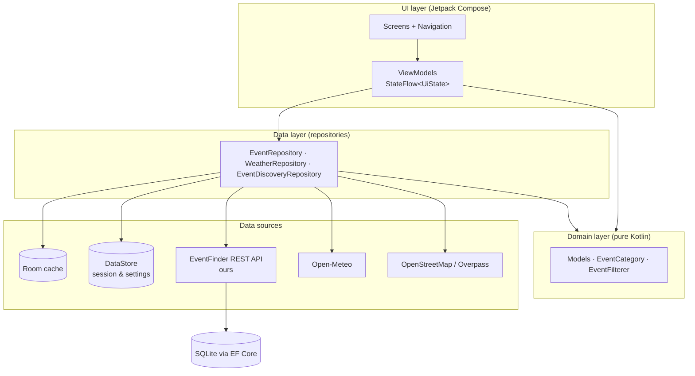

# EventFinder South Africa

[](https://github.com/kallanjones/prog7314-g3-2026-formative-2-part-2-kallanjones/actions/workflows/android-ci.yml)

A native Android app for finding, saving and creating local events across South Africa.
Built for PROG7314 Part 2.

The repository holds two projects:

- `app/` — the Android client, Kotlin and Jetpack Compose.
- `api/` — our REST API, ASP.NET Core 8 with EF Core over SQLite, deployed to Render.

## Team

| Name | Student number |
| --- | --- |
| Kallan Jones | ST10445389 |
| Zulfique Jattiem | ST10403582 |
| Morgan Gibbon | ST10439398 |

## Demonstration video

https://youtu.be/8Hr-pQSrUFs

Covers sign-in including Google SSO, the settings menu, the data round trip against the
hosted REST API, and the user-defined features.

## Screenshots

Captured on an Android 14 (API 34) emulator at 1080 × 2340.

| Login | Register | Home (Discover) | Event detail |
| :---: | :---: | :---: | :---: |
|  |  |  |  |

| Map | Search | Create event | Settings |
| :---: | :---: | :---: | :---: |
|  |  |  |  |

## Features

**Discover** — browse the catalogue, filter by category or keyword, sort by date, distance or
name. Distance uses the Haversine formula against the device location.

**Map** — events plotted on OpenStreetMap tiles through osmdroid. No Google Maps key, no billing.

**Event detail** — organiser, attendee count, directions, share, RSVP, and the weather forecast
for that venue on the day of the event.

**Create event** — a three-step wizard covering details, date and time, then location, with an
optional photo. Organisers can edit or delete their own events.

**Favourites and profile** — save events for offline viewing; profile shows events created,
attending and favourited.

**Settings** — language (English or Afrikaans), event reminders, new-event alerts, biometric
login, change password, clear cache, delete account.

**Reminders** — `AlarmManager` notifications 24 hours and 1 hour before an event you are
attending, cancelled if you decline.

## The REST API

The event catalogue is served by our own API in [`api/`](api), an ASP.NET Core 8 Minimal API
using EF Core code-first over SQLite. The Part 1 design specified Azure SQL; SQLite replaced it
so the service runs on a free tier without a separate database server. The schema and endpoints
are otherwise as designed.

Live at **https://eventfinder-api-si8u.onrender.com** —
[Swagger](https://eventfinder-api-si8u.onrender.com/swagger) ·
[health](https://eventfinder-api-si8u.onrender.com/api/health)

Render's free plan sleeps when idle, so the first request after a quiet period takes up to a
minute.

| Method | Route | Purpose |
| --- | --- | --- |
| `GET` | `/api/health` | Liveness probe |
| `GET` | `/api/events` | List events (`?category=`, `?q=`, `?page=`, `?pageSize=`) |
| `GET` | `/api/events/{id}` | Fetch one event |
| `POST` | `/api/events` | Create an event |
| `PUT` | `/api/events/{id}` | Update an event |
| `DELETE` | `/api/events/{id}` | Delete an event |

Every endpoint returns the same envelope, so the client handles all outcomes the same way:

```json
{ "success": true, "data": { }, "message": null, "errors": null }
```

Validation failures return 400 with field-level messages in `errors`; unknown ids return 404.

### How the app consumes it

`EventFinderApiSource` implements the same `EventSource` interface as the public feeds, so API
events reach the Room cache through the existing ingestion pipeline:

```
EventFinderApi (Retrofit)
        │
        ▼
EventFinderApiSource ──┐
RssEventSource ────────┤
IcsEventSource ────────┼──▶ EventDiscoveryRepository ──▶ Room ──▶ UI
PublicJsonEventSource ─┘
```

The base URL is a `BuildConfig` field:

| Build type | Source | Default |
| --- | --- | --- |
| `debug` | `api.base.url` in `local.properties` (gitignored, per machine) | `http://10.0.2.2:5217/` for the emulator |
| `release` | `API_BASE_URL_RELEASE` in `gradle.properties` (committed) | the Render deployment |

Running it locally, deploying it, and testing against a phone are covered in
[`api/README.md`](api/README.md).

## Architecture

MVVM in three layers. The UI never touches Retrofit or Room directly; everything goes through
repositories.



Events, favourites and RSVPs are cached in Room and observed as flows, so the UI renders from
cache immediately and a failed network call never blocks it. Mutations run inside `@Transaction`
boundaries.

## Tech stack

Kotlin 1.9.22 · Jetpack Compose (BOM 2024.02, Material 3) · MVVM with a manual `AppContainer`
for DI · Room 2.6.1 · DataStore · Retrofit 2.9 with OkHttp 4.12 · Coil 2.6 · osmdroid 6.1.18 ·
AndroidX Biometric 1.1 · AndroidX Credential Manager 1.3 for Google sign-in.

Back end: ASP.NET Core 8 Minimal API · EF Core 8 · SQLite · Docker.

Build: AGP 8.2.2, Gradle 8.7, JDK 17. minSdk 26, targetSdk 34.

## External services

All keyless:

| Service | Used for |
| --- | --- |
| Open-Meteo | Weather forecast at a venue, and geocoding place names |
| OpenStreetMap / Overpass | Map tiles and nearby venue discovery |
| Aticket South Africa (RSS) | Public event feed |
| Motorsport South Africa (ICS) | Public event feed |
| Ardent Africa (JSON) | Public event feed |

Feed events are normalised into a common `RemoteEvent`, validated (future-only, non-blank title),
geocoded when coordinates are missing, and upserted into Room. New sources are added in
`SouthAfricaEventSources.kt` without touching anything else.

## Getting started

Requires Android Studio (JDK 17 bundled), and .NET 8 SDK if you want to run the API locally.

```bash
git clone https://github.com/kallanjones/prog7314-g3-2026-formative-2-part-2-kallanjones.git
```

Open the folder in Android Studio once so it writes `local.properties` with your SDK path. That
file is gitignored, so it is not in the clone, and Gradle fails with "SDK location not found"
without it.

### Google sign-in

The app builds and runs without any Google configuration; the button reports that sign-in is not
configured until a client ID is set. To enable it:

1. In the [Google Cloud Console](https://console.cloud.google.com/), configure the OAuth consent
   screen as **External**, and add every Gmail account that will sign in under **Test users**.
2. Create two OAuth clients:
   - **Android** — package `com.eventfinder.app`, plus the debug SHA-1 of every machine that
     builds the app. Get yours with `./gradlew signingReport`. One client holds many
     fingerprints, so add each teammate's.
   - **Web application** — Credential Manager's `setServerClientId` expects the *Web* client ID,
     even though the app is Android.
3. Put the Web client ID in `gradle.properties` as `GOOGLE_WEB_CLIENT_ID`.

If sign-in reports that Google had no account to offer, the cause is usually an unregistered
SHA-1 or an account missing from the test-user list, not a missing account on the device.
`adb logcat -s EventFinder` prints the underlying message.

### Build and install

```bash
./gradlew installDebug
```

On Windows PowerShell use `.\gradlew installDebug`. PowerShell 5.1 has no `&&`, so run chained
commands on separate lines.

## Testing

159 JVM unit tests for the app and 8 endpoint tests for the API, none needing an emulator:

```bash
./gradlew testDebugUnitTest
dotnet test api/EventFinder.Api.Tests
```

They cover validation and password hashing, distance and filtering, the event and auth
repositories against in-memory DAO fakes, the discovery pipeline (rejecting past events and
events without coordinates, deduplication, per-source failure), feed parsing for RSS, ICS and
JSON, and the API's own endpoints over real HTTP. Reports land in
`app/build/reports/tests/testDebugUnitTest/index.html`.

Six Compose UI tests cover the shared widgets and run on a device:

```bash
./gradlew connectedDebugAndroidTest
```

## Continuous integration

`.github/workflows/android-ci.yml` runs on every push and pull request to `main`, in three jobs:

1. **api-test** — sets up .NET 8, builds the API and runs its 8 endpoint tests.
2. **build-and-test** — validates the Gradle wrapper, runs the unit tests, lint and
   `assembleDebug`, then uploads the test report and the debug APK.
3. **instrumentation-test** — runs the Compose UI tests on an API 33 emulator.

Nothing in CI needs a secret: the public APIs are keyless, and Google sign-in falls back to its
unconfigured state when no client ID is present.

## Project structure

```
app/src/main/java/com/eventfinder/app/
├── data/
│   ├── local/        Room entities, DAOs, database, mappers
│   ├── remote/       Retrofit services and DTOs (our API, Open-Meteo, Overpass)
│   ├── repository/   Event / Auth / Weather / Discovery repositories
│   ├── sources/      EventSource interface, EventFinderApiSource, RSS/ICS/JSON sources
│   └── store/        DataStore preferences
├── di/               AppContainer (manual dependency injection)
├── domain/model/     Event, User, RSVP, categories, filter and sort
├── notifications/    Notification channels and reminder receiver
├── security/         Biometric authentication and Google sign-in
├── ui/               Compose screens, navigation, shared components, theme
└── utils/            Logging, date/time, distance, validation, hashing, locale

api/EventFinder.Api/        Program.cs, Models/, Data/ (EF Core DbContext), Dockerfile
api/EventFinder.Api.Tests/  8 endpoint tests driving the real host over HTTP
```

## Requirement traceability

| Requirement | Where |
| --- | --- |
| Creation of a REST API | [`api/EventFinder.Api`](api) — ASP.NET Core 8, EF Core, SQLite |
| Integration of our REST API | `EventFinderApi` and `EventFinderApiSource` into `EventDiscoveryRepository` |
| SSO sign-in | `GoogleSignInClient` → `AuthRepository.signInWithGoogle` |
| Settings menu | `SettingsScreen` / `SettingsViewModel` |
| Third-party API integration | `WeatherRepository`, `OpenStreetMapRepository` |
| External libraries | Room, Retrofit/OkHttp, DataStore, Coil, osmdroid, Biometric, Credential Manager |
| Native SDK integration | `AlarmManager`, `NotificationManager`, location APIs, biometrics |
| Unit testing | 159 JVM + 8 API + 6 Compose tests, all run in GitHub Actions |
| Logging and comments | `AppLogger` across the data and UI layers; KDoc on classes |

## Known limitations

- **Attendee management** — RSVPs are counted locally. Approving or declining other people's
  attendance would need per-user records on the server.
- **Password reset** looks the account up by email and updates the local hash. It proves no
  ownership of the address, so it would need email or SMS verification in production.
- **Push notifications** are on-device (`AlarmManager` and `NotificationManager`) rather than
  Firebase Cloud Messaging.
- **Default city and radius** exist in the data layer but have no settings UI.
- **API persistence** — Render's free plan has no persistent disk, so the API database resets on
  redeploy. `api/README.md` covers hosts that keep it.

## Attribution

- Weather data by [Open-Meteo](https://open-meteo.com) (CC-BY 4.0).
- Map data © OpenStreetMap contributors; venue discovery via the Overpass API (ODbL).
- Haversine implementation adapted from [Movable Type Scripts](https://www.movable-type.co.uk/scripts/latlong.html) by Chris Veness.
- Password hashing follows the [OWASP Password Storage Cheat Sheet](https://cheatsheetseries.owasp.org/cheatsheets/Password_Storage_Cheat_Sheet.html).
